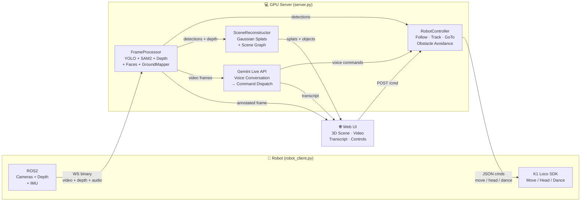
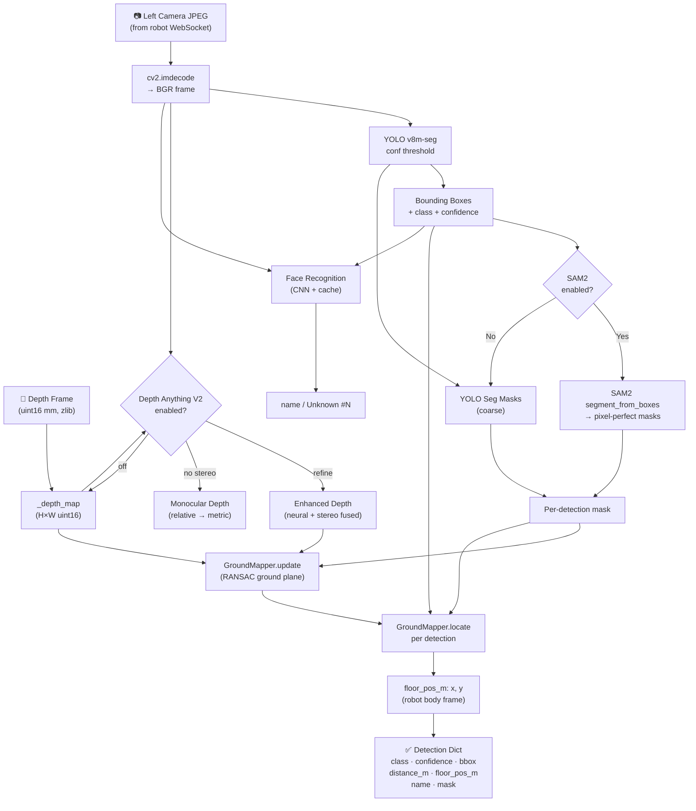
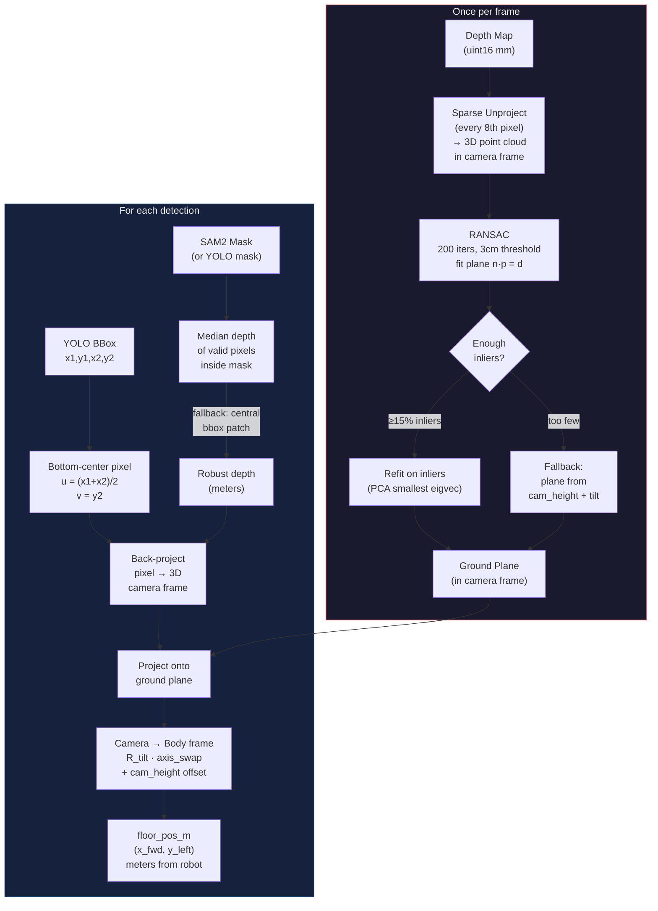
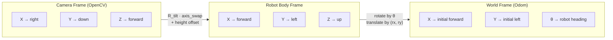
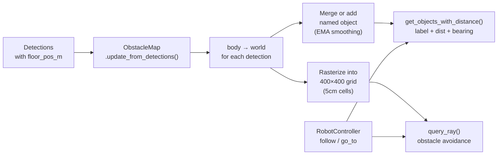
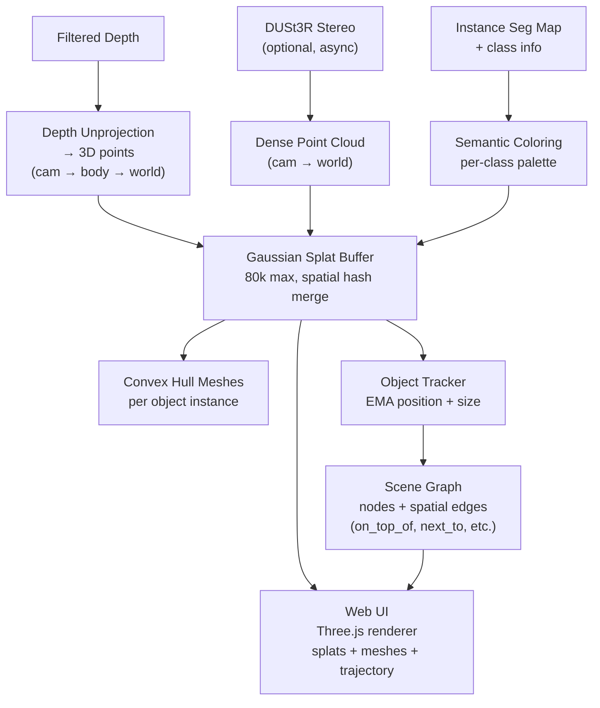
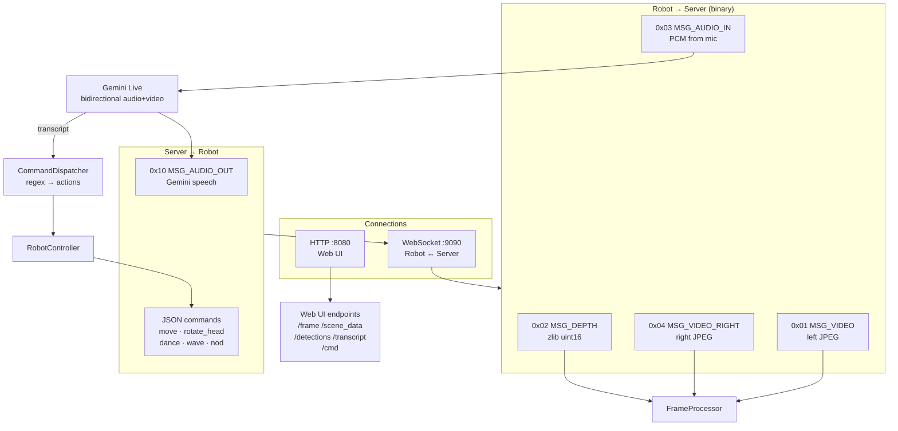

# K1 Walking & Talking — Architecture

A voice-controlled robotics system for the **Booster K1 humanoid**.
The robot streams camera, depth, and audio to a GPU server over WebSocket.
The server runs vision (YOLO, SAM2, depth), talks to Gemini Live for
conversational AI, and sends movement commands back to the robot.

---

## High-Level System

---

## Vision Pipeline (per frame)

---

## Ground Mapper — How Floor Localization Works

---

## Coordinate Systems

| Transform | What it does |
|-----------|-------------|
| **Camera → Body** | Swap axes (Z→X, −X→Y, −Y→Z), undo tilt, add camera height |
| **Body → World** | Rotate by `robot_theta`, translate by `(robot_x, robot_y)` |

---

## Obstacle Map Integration

---

## 3D Scene Reconstruction

---

## Server Wiring

---

## Module Map

| Module | Purpose |
|--------|---------|
| `server.py` | Entry point — HTTP + WS server, Gemini session, wires everything |
| `robot_client.py` | Runs on robot — ROS2 subs, streams to server, executes commands |
| `frame_processor.py` | YOLO + SAM2 + faces + depth + ground mapper + scene recon |
| `ground_mapper.py` | RANSAC ground plane, floor localization, calibration helper |
| `robot_controller.py` | Follow, track, go-to, obstacle avoidance, movement commands |
| `scene_reconstructor.py` | Gaussian splat accumulation, object meshes, trajectory |
| `scene_graph.py` | Semantic graph — spatial relations between tracked objects |
| `obstacle_map.py` | 2D occupancy grid, ray queries, detection-based updates |
| `depth_model.py` | Depth Anything V2 neural depth (optional) |
| `sam2_segmenter.py` | SAM2 instance segmentation (optional) |
| `stereo_depth.py` | Stereo disparity, point clouds, gradient maps |
| `dust3r_reconstructor.py` | DUSt3R dense 3D from stereo pairs (optional) |
